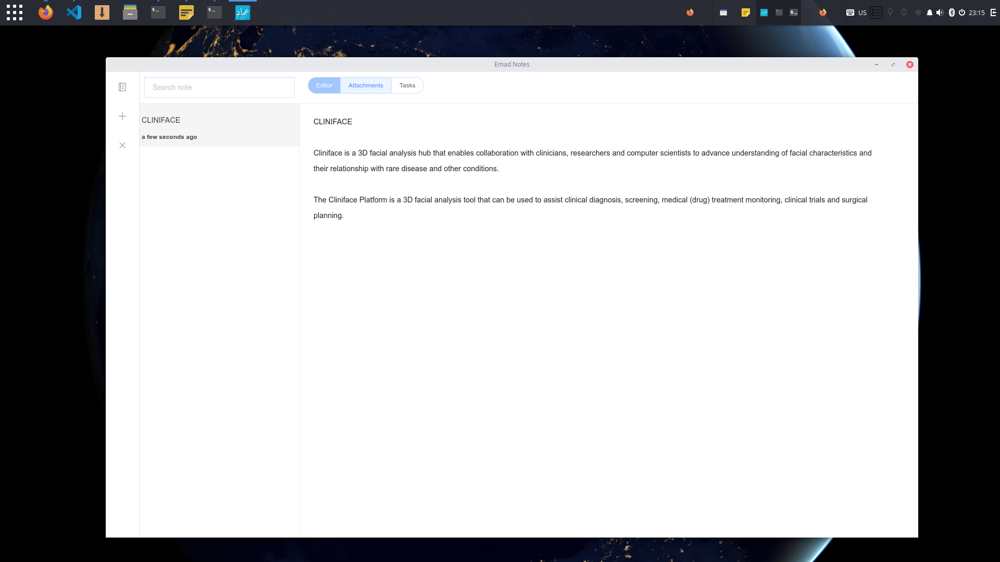

# Emad Note: Note-taking app for busy minds
---
This is work-in-progress Note-taking app, built to help us taking editorial notes and write articles for Medevel.com 




## Features
- Note taking
- Attachment editor URL, Notes with #tags support
- Task taking
- Note search


## Incoming Features
- Layout support
- Note export
- Markdown support
- Code snippets 
- Attachments Search
- Command supports

## Planned 
- Git support
- Dropbox support
- Firebase support

--- 

## Development Note

This project is built using Vue, Electron and NeDB. 
> An electron-vue project

#### Build Setup

``` bash
# install dependencies
npm install

# serve with hot reload at localhost:9080
npm run dev

# build electron application for production
npm run build

# run unit & end-to-end tests
npm test


# lint all JS/Vue component files in `src/`
npm run lint

```